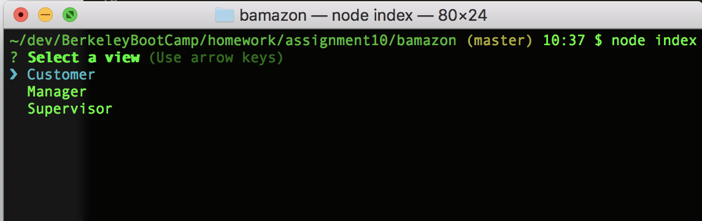
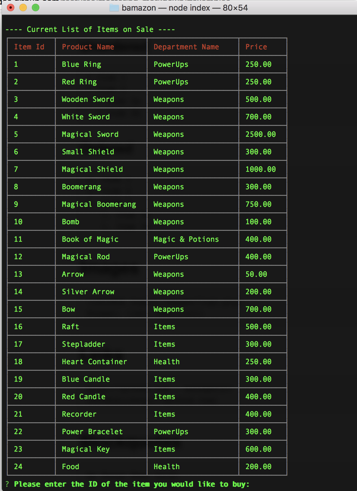
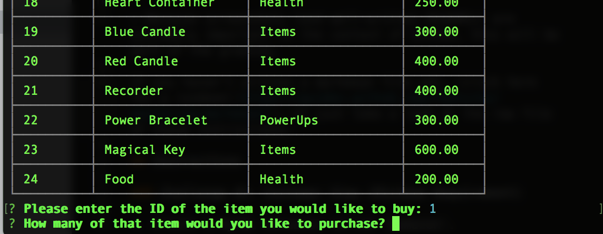
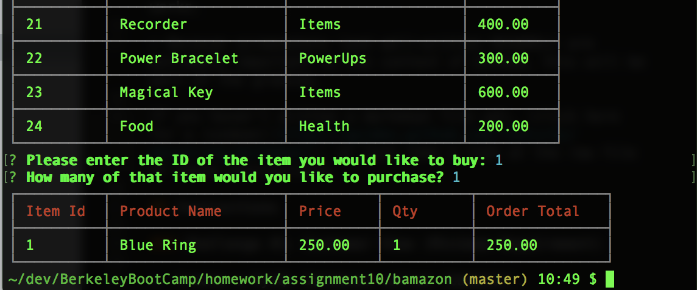
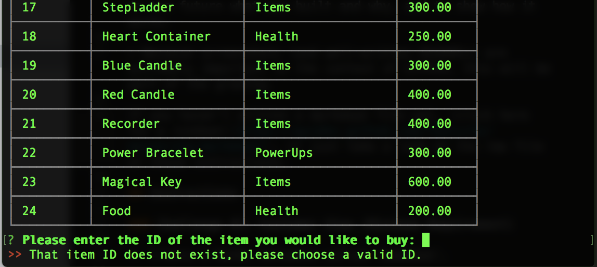
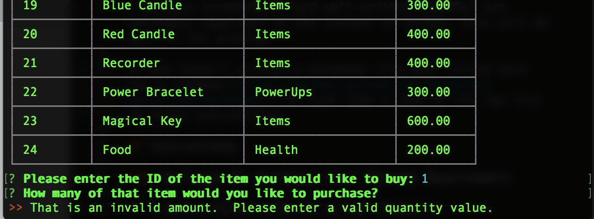
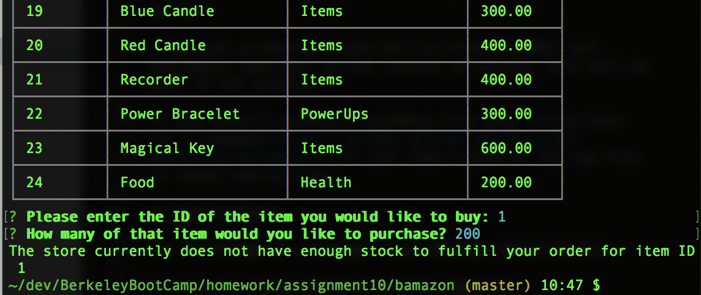

# bamazon

## What is it?
A Node.js based terminal store front utilizing a MySQL database.

The application provides 3 views:

	* Customer
	* Manager
	* Supervisor

Refer to the [**Show Me**](#show-me) section below for examples on how to use each of the views.

## How do I use it?

Clone this repository and then run:

`npm install`

Then, to run the applicaton run:

`node index`

## Show Me

After execuring `node index`, you will be presented with a list of view options to choose from.

## Customer View

When the Customer view is selected, you will be presented with a table of all the items currently for sale.

After entering a valid item ID, you will be asked to provide the amount to purchase.

If the store has enough inventory on hand to complete your order, you will be presented with an order summary.

### Invalid Input Handling

During order processing, if an invalid item ID/quantity value is provided, you will not be allowed to proceed until a valid item ID/quantity is entered.

If the store does not have enough quanity on hand, the order will not be processed.

## Manager View

## Supervisor View
